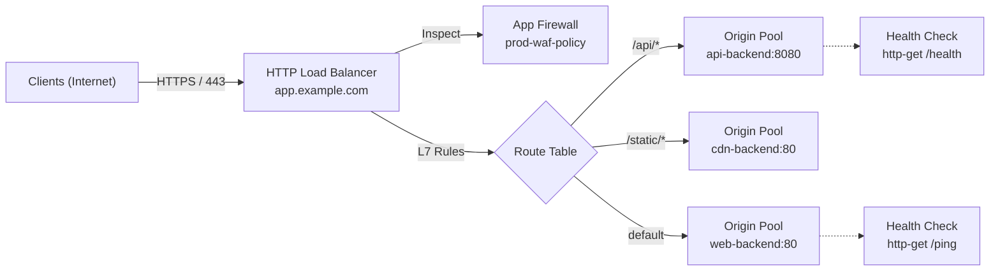

The **F5 Distributed Cloud Tools** extension provides built-in telemetry tools to observe live traffic, inspect access logs, evaluate performance metrics, and visualize load balancer architectures directly inside Visual Studio Code.

## Real-Time Access Logs

You can inspect HTTP and TCP access logs for load balancers without navigating away from your editor:

1. In the **Explorer** view, expand **HTTP Load Balancers** or **TCP Load Balancers**.
2. Right-click your load balancer and select **View Logs** (or run `xcsh.viewLogs`).
3. The extension queries the F5 Distributed Cloud telemetry API (`/api/data/namespaces/{namespace}/access_logs`) for the last hour of traffic matching the virtual host.
4. The logs open in a formatted document showing structured request details:

```text
[2026-08-18T10:15:32Z] REQ-a1b2c3d4 203.0.113.45 GET app.example.com/api/v1/health 200 (12ms)
  WAF Action: ALLOWED | Bot: HUMAN | Country: US | TLS: TLSv1.3
[2026-08-18T10:15:35Z] REQ-e5f6g7h8 198.51.100.22 POST app.example.com/api/v1/login 403 (4ms)
  WAF Action: BLOCKED (Rule: SQLi-Signature-1002) | Bot: SUSPICIOUS
```

### Log Data Fields

The access log viewer surfaces critical security and operational dimensions:

- **Timestamp & Request ID**: Granular execution timing and correlation identifiers.
- **Source IP & Country**: Client network origin and geographic metadata.
- **HTTP Method & Path**: Target Uniform Resource Identifier (URI) and verb.
- **Response Code & Duration**: Upstream response status and latency in milliseconds.
- **WAF Action**: Security firewall determinations (`ALLOWED`, `BLOCKED`, `MONITORED`).
- **Bot Classification**: Automated bot defense categories (`HUMAN`, `GOOD_BOT`, `MALICIOUS_BOT`).

## Performance Metrics

To view performance metrics for load balancers or origin pools:

1. In the **Explorer** view, right-click the target resource and select **View Metrics** (or run `xcsh.viewMetrics`).
2. The extension queries the metrics endpoint (`/api/data/namespaces/{namespace}/metrics`) and computes aggregate statistics.
3. The metrics view reports request rates, error distributions (4xx and 5xx response code classes), and latency statistics.

## Interactive Architecture Diagrams

For HTTP Load Balancers, the extension generates topology diagrams that visualize traffic flow and policy attachments:

1. In the **Explorer** view, right-click an HTTP Load Balancer and select **Generate Diagram** (or run `xcsh.diagram`).
2. The extension queries the live resource configuration, resolves attached origin pools, WAF policies, and service policies, and renders an interactive visual architecture diagram:



### Diagram Features

- **Component Resolution**: Maps domain names, TLS termination modes, attached App Firewalls, active service policies, routing match criteria, and backend origin pools.
- **Health Check Association**: Indicates the active health monitor linked to each origin pool.
- **Interactive Controls**: Export diagrams as standard Mermaid markdown or copy SVG renderings for architecture documentation.
